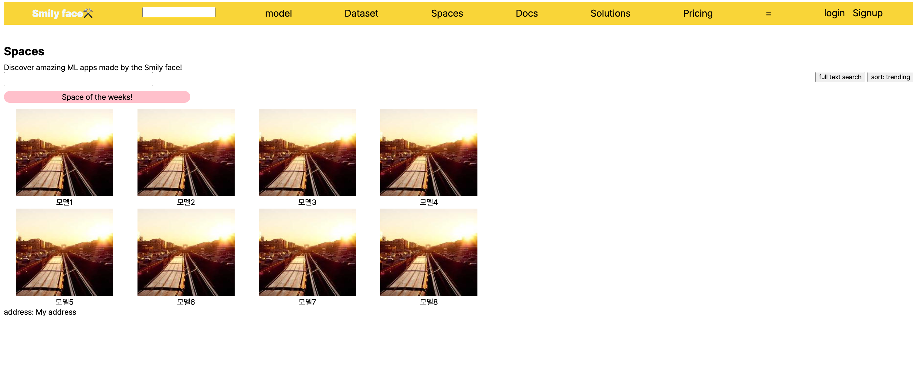

# 과제 3

허깅페이스를 본딴 SmilyFace라는 웹사이트를 컨셉으로 비슷한 레이아웃으로 만들려고 시도해보았다.

## 레이아웃


## 구현화면



```
본 후기는 정보통신산업진흥원(NIPA)에서 주관하는 <AI 서비스 완성! AI+웹개발 취업캠프 - 프론트엔드&백엔드> 과정 학습/프로젝트/과제 기록으로 작성 되었습니다.
#정보통신산업진흥원 #NIPA #AI교육 #프로젝트 #유데미 #IT개발캠프 #개발자부트캠프 #프론트엔드 #백엔드 #AI웹개발취업캠프 #취업캠프 #개발취업캠프
```
